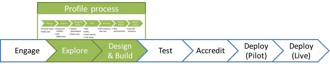



# Introduction #
To add...

# Using this guide #
This guide has been created to support the use of the FHIR&reg; ODS API. To add...

# Focus #

The current site focuses on a typical API Developer's Journey as highlighted by the green boxes below in the developer journey:

NHS Digital is progressing the profile development and the testing process.

Please see the explanation of the complete development roadmap.

# Profile Roadmap #

TBC
