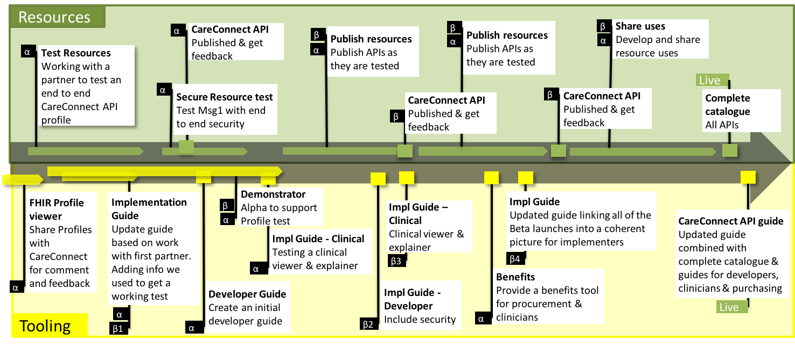





# Introduction #

The FHIR&reg; ODS Lookup API within this site has been developed by NHS Digital. The API aims to  better support the delivery of care by opening up information and data stored by the Organization Data Service (ODS).

The vision is to create a library of nationally defined HL7® FHIR® resources and interaction patterns that implementers can adopt to simplify integration and interoperability within UK health and social care.

# Using this guide #

This guide has been created to support the adoption of the FHIR&reg; ODS Lookup API profiles and FHIR resources. As such the site is structured around stakeholders including API users, developers and architects, who have an interest in implementing the FHIR&reg; ODS Lookup API.  



The above steps outline a complete API journey from imagination and exploring to developing applications that utilize FHIR&reg; ODS Lookup API.



# FHIR&reg; ODS Lookup Focus #

The current site focuses on a typical API Developer's Journey as highlighted by the green boxes below in the developer journey:

NHS Digital is contributing to progressing the profile developmenet, the testing process and invitations are open for the health and social care community to get involved and progress the wider developer ecosystem.

Please see the explanation of the complete development roadmap.

# Resource Roadmap #

The [API journey](overview_api_journey.html) outlines the development roadmap for the RESTful APIs outlined within this site.

The above roadmap illustrates the steps necessary to create, test and verify the profiles as well as some of the supporting tooling which might be necessary to build to provide viable APIs. The roadmap is not intended to be complete but to promote discussion, extension and engagement from the health and social care community.


